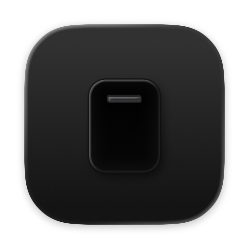

<h1 align="center">
    <br />
    stele
</h1>

<p align="center">
    stele is a lightweight macos gui clipboard utility built with rust and <a href="https://gpui.rs/">gpui</a>
</p>

> [!NOTE]
> this is built for personal use and exploratory purposes - no guarantees can be made about the code quality

> [!WARNING]
> releases are currently not signed or notarized - macos will block the app by default. to run it, right-click the app and select "Open", or remove the quarantine attribute: `xattr -d com.apple.quarantine /path/to/stele.app`

## installation

1. download the latest release from the [releases page](https://github.com/chunyin7/stele/releases)
2. open the dmg file and drag the app to your applications folder

or build manually:
```bash
# 1. install dependencies
rustup default stable                 # or nightly if needed

# 2. run the app in debug mode
cargo run

# 3. build the macos bundle
./build.sh
```

when stele is running:

1. copy any text as usual (`⌘c`).
2. hit `⌘⇧v` to toggle the stele panel.
2. navigate using keyboard (j/k) or mouse
3. click an entry to copy it back to the clipboard or press enter when using keyboard controls to select - the panel closes automatically

## todo

- [x] add image support
- [ ] add config settings
- [x] hide dock icon
- [x] add tray icon
- [x] add keyboard controls
- [x] fix stutter on panel hide
